# lab01-基础网络配置

## 1. 配置slitaz虚拟机
    
先导入slitaz linux虚拟机文件，命名虚拟机为PC1， 使用完整复制创建PC2, PC3

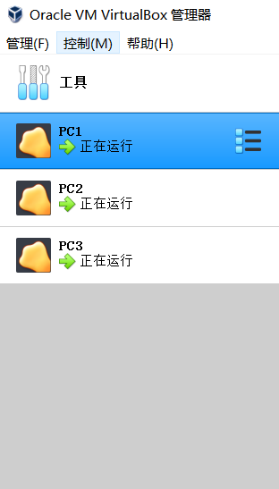

## 2. 创建GNS3项目并配置

- 创建项目lab01
- Edit-Preferences-VirtualBox 添加PC1,PC2,PC3三个虚拟机，并修改网卡数量为3
- 搭建网络结构，PC1与PC2的eth1相连，PC1与PC3的eth2相连，网络拓扑如下图所示
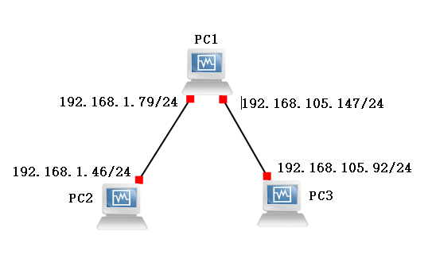


## 3. 配置虚拟机IP地址及路由表

### 启动eth1, eth2网卡

启动网卡
```shell
sudo ip link set {ADAPTOR} up
```
禁用网卡

```shell
sduo ip link set {ADAPTOR} down
```
对PC1,PC2,PC3都进行启动网卡操作后，使用`ip link`命令结果如下：


### 配置IP地址

按下表进行IP地址的配置
|HOSTNAME|IP |Adaptor|
|:------:|:-:|:----:|
|PC1|192.168.1.79/24|eth1|
|PC1|192.168.105.147/24|eth2|
|PC2|192.168.1.46/24|eth1|
|PC3|192.168.105.92/24|eth2|

IP地址配置命令如下：
```shell
#查看IP地址
ip addr
#添加IP地址
sudo ip address add {NETWORK/MASK} dev {ADAPTOR}
#删除IP地址
sudo ip address add {NETWORK/MASK} dev {ADAPTOR}
```

PC1:
```shell
sudo ip address add 192.168.1.79/24 dev eth1
sudo ip address add 192.168.105.147/24 dev eth2
ip addr
```
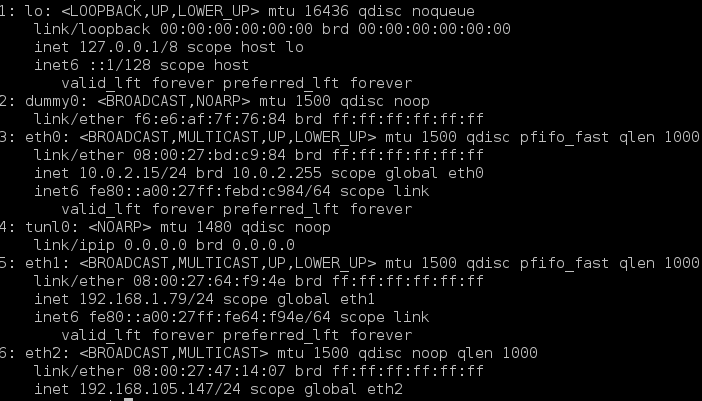

PC2:
```shell
sudo ip address add 192.168.1.46/24 dev eth1
ip addr
```
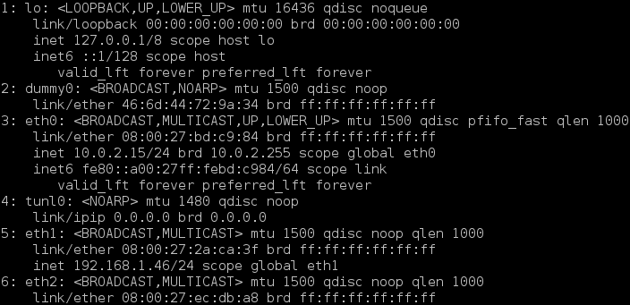

PC3:
```shell
sudo ip address add 192.168.105.92/24 dev eth2
ip addr
```
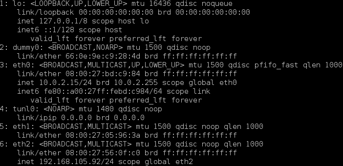

### 配置路由表
配置路由命令
```shell
#显示路由
ip route
#增删路由
sudo ip route add/del {NETWORK/MASK} via {GATEWAYIP} dev {ADAPTOR}
#默认路由
sudo ip route add default via {GATEWAYIP}
```

PC1路由表

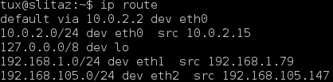

PC2路由表
```shell
sudo ip route add 192.168.105.0/24 via 192.168.1.79 dev eth1
ip route
```
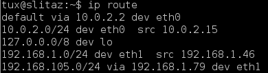

PC3路由表
```shell
sudo ip route add 192.168.1.0/24 via 192.168.105.147 dev eth1
ip route
```


## 4. PING测试

### PC2->PC1

```shell
ping 192.168.1.79
```
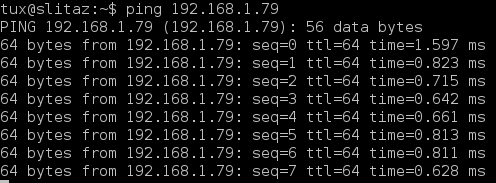

```shell
ping 192.168.105.147
```
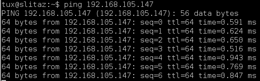

测试成功！

### PC3->PC1

```shell
ping 192.168.1.79
```
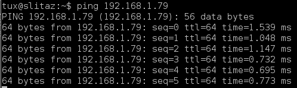

```shell
ping 192.168.105.147
```
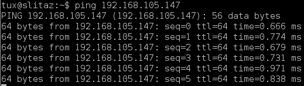

测试成功！

### PC2->PC3第一次尝试

```shell
ping 192.168.105.92
```


ping不通，测试失败

### 启动PC1转发功能

```
sudo su
echo "1"> /proc/sys/net/ipv4/ip_forward
```

### PC2->PC3第二次尝试

```shell
ping 192.168.105.92
```
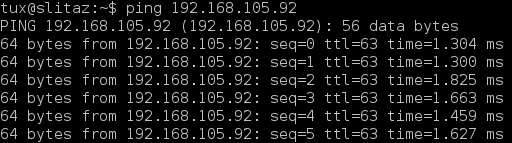

测试成功！
